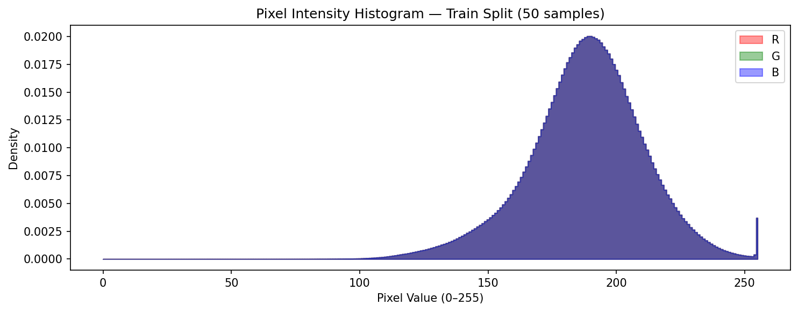

# KolektorSDD 표면 결함 분류 (Surface Defect Classification)

> KolektorSDD 산업용 표면 결함 데이터셋을 활용한 머신비전 이진 분류 프로젝트

[](https://python.org)
[](https://pytorch.org)
[](LICENSE)

---

## 목차 (Table of Contents)

1. [프로젝트 개요](#프로젝트-개요-overview)
2. [데이터셋](#데이터셋-dataset)
3. [프로젝트 구조](#프로젝트-구조-structure)
4. [설치 및 실행](#설치-및-실행-setup--run)
5. [결과](#결과-results)
   - [탐색적 데이터 분석](#탐색적-데이터-분석-exploratory-data-analysis)
   - [베이스라인 모델](#베이스라인-모델-baseline-cnn)
6. [개발 로드맵](#개발-로드맵-roadmap)
7. [라이센스](#라이센스-license)

---

## 프로젝트 개요 (Overview)

KolektorSDD 산업용 표면 결함 데이터셋을 활용한 이진 분류 (Binary Classification) 프로젝트입니다. 총 399장의 이미지 중 52장(결함)과 347장(정상)으로 구성된 클래스 불균형 (Class Imbalance) 환경에서, 데이터 중심 개선 (Data-Centric) 과 모델 중심 개선 (Model-Centric) 을 결합하여 결함 탐지 성능을 높이는 것이 핵심 목적입니다.

단순 분류 성능 지표(F1, AUC)에 더해, 결함 미검출(FN)이 오경보(FP)보다 훨씬 큰 손실을 유발하는 산업 현장의 특성을 반영한 비용 시뮬레이션을 함께 수행합니다. 비용 수치는 시뮬레이션용 가정치이며, 실제 적용 시에는 공정별 실측 비용으로 대체되어야 합니다.

실제 산업 적용에서는 FN/FP의 비용 차이를 반영한 Total Cost를 함께 고려합니다.

**Total Cost = FN × C_FN + FP × C_FP**

F1·AUC 개선을 통해 FN·FP를 줄이는 것이 기본 목표이며, 여기에 더해 비용 구조의 비대칭성(FN >> FP)을 고려한 threshold 최적화를 통해 Total Cost를 최소화하는 것이 최종 목표입니다.

---

## 데이터셋 (Dataset)

### KolektorSDD

| 항목 | 내용 |
|---|---|
| 전체 이미지 | 399장 |
| 결함 (Defect) | 52장 |
| 정상 (Normal) | 347장 |
| 불균형 비율 (Imbalance Ratio) | ~1:6.7 (결함:정상) |
| 파트 수 (Parts) | 50개 |
| 이미지 크기 범위 | 500x1235 ~ 500x1285 픽셀 |

**출처 및 저작권:**
- 논문: "Segmentation-based deep-learning approach for surface-defect detection"
- 데이터셋 공식 페이지: https://www.vicos.si/resources/kolektorsdd/
- 라이센스: **CC BY-NC-SA 4.0**

**사용 안내:**
- 본 프로젝트는 **교육 및 포트폴리오 목적**으로 데이터셋을 사용합니다.
- 원본 데이터 파일은 저장소에 포함되지 않습니다 (`.gitignore` 처리).
- 데이터셋은 위 공식 출처에서 직접 다운로드하시기 바랍니다.

---

## 프로젝트 구조 (Structure)

```
kolektorsdd-classification/
├── configs/
│   ├── base.yaml                    # 공통 설정 (Config)
│   └── experiment_baseline.yaml     # 베이스라인 실험 설정
├── data/
│   ├── raw/                         # 원본 데이터 (gitignore)
│   └── processed/
│       ├── train.csv                # 학습 분할 (Split)
│       ├── val.csv                  # 검증 분할
│       └── test.csv                 # 테스트 분할
├── experiments/
│   └── baseline/
│       ├── results.json             # 베이스라인 실험 결과
│       └── figures/                 # 학습 곡선 및 평가 시각화
├── notebooks/
│   ├── 01_eda.ipynb                 # 탐색적 데이터 분석 노트북
│   └── 02_baseline.ipynb            # 베이스라인 모델 노트북
├── reports/
│   └── figures/                     # EDA 시각화 이미지
├── src/
│   ├── data/                        # 데이터셋 및 전처리
│   ├── models/                      # 모델 정의
│   ├── training/                    # 학습 루프
│   ├── evaluation/                  # 평가 지표
│   └── utils/                       # 유틸리티
├── requirements.txt
└── pyproject.toml
```

---

## 설치 및 실행 (Setup & Run)

### 1. 환경 설정

```bash
git clone https://github.com/shinnhyuk/kolektorsdd-classification.git
cd kolektorsdd-classification
pip install -r requirements.txt
```

### 2. 데이터셋 준비

KolektorSDD 데이터셋을 [공식 페이지](https://www.vicos.si/resources/kolektorsdd/)에서 다운로드한 후 아래 경로에 배치합니다.

```
data/raw/KolektorSDD/
├── kos01/
│   ├── Part0.jpg
│   ├── Part0_label.bmp
│   └── ...
├── kos02/
└── ...
```

---

## 결과 (Results)

### 탐색적 데이터 분석 (Exploratory Data Analysis)

데이터셋 전반을 분석하고, 파트 단위 계층적 분할 (Part-level Stratified Split) 을 완료했습니다. 동일 파트의 이미지가 학습/검증/테스트에 중복 포함되지 않도록 하여 데이터 누수 (Data Leakage) 를 방지했습니다.

**픽셀 통계 (train 기준):**

| 항목 | 값 |
|---|---|
| 평균 (Mean) | 0.7317 |
| 표준편차 (Std) | 0.0915 |
| 이미지 크기 범위 | 500x1235 ~ 500x1285 |

**데이터 분할 결과 (Part-level Stratified Split):**

| 분할 (Split) | 전체 | 결함 (Defect) | 정상 (Normal) |
|---|---|---|---|
| train | 280장 | 36장 | 244장 |
| val | 56장 | 7장 | 49장 |
| test | 63장 | 9장 | 54장 |

**EDA 시각화:**

클래스 분포 (Class Distribution):


정상 샘플 (Normal Samples):


결함 샘플 (Defect Samples):


픽셀 강도 분포 (Pixel Intensity Distribution):



---

### 베이스라인 모델 (Baseline CNN)

최소한의 증강 (수평 플립, 리사이즈, 정규화)만 적용한 커스텀 CNN (Convolutional Neural Network) 으로 초기 성능 기준선 (Baseline) 을 수립했습니다. 클래스 불균형 대응을 위해 BCEWithLogitsLoss에 pos_weight를 자동 계산하여 적용했습니다.

**모델 구성:**

| 항목 | 값 |
|---|---|
| 아키텍처 (Architecture) | Custom CNN (3-block) |
| 입력 크기 (Input Size) | 256x256 |
| 손실 함수 (Loss) | BCEWithLogitsLoss (pos_weight 자동계산) |
| 옵티마이저 (Optimizer) | Adam (lr=0.001) |
| 스케줄러 (Scheduler) | CosineAnnealing |
| 에폭 (Epochs) | 50 (Early Stopping patience=10) |

**평가 결과 (threshold=0.5):**

| 분할 (Split) | F1 | AUC-ROC | Precision | Recall |
|---|---|---|---|---|
| val | 0.2727 | 0.5569 | 0.1622 | 0.8571 |
| test | 0.2632 | 0.5535 | 0.1724 | 0.5556 |

> 높은 재현율 (Recall) 과 낮은 정밀도 (Precision) 가 공존하는 전형적인 불균형 초기 결과입니다. 이후 데이터 파이프라인 및 모델 개선을 통해 F1과 AUC-ROC를 함께 끌어올리는 것이 목표입니다.

**실패 케이스 분석 (test set 기준):**

| 구분 | 건수 | 추정 비용 (가정치) |
|---|---|---|
| FN (결함 미검출) | 7건 | 50,000,000원/건 → 350,000,000원 |
| FP (오경보) | 3건 | 500,000원/건 → 1,500,000원 |
| **합계** | | **351,500,000원** (FN이 99.6% 차지) |

> FN 비용(50,000,000원/건)은 결함 1건이 품질 검사를 통과하여 출하될 경우 발생할 수 있는 리콜·보상·라인 중단 등의 하류 리스크를 금전적으로 환산한 잠재 비용(potential cost)을 보수적으로 추정한 값입니다. 본 프로젝트에서는 모델 비교 및 threshold 최적화를 위해 FN/FP 비용을 건별 비용으로 단순화하여 Total Cost를 계산합니다.

- **FN 주원인:** 원본 이미지 세로 방향 5배 압축으로 인한 결함 소실 / 학습 결함 데이터 부족(36장) / threshold=0.5 부적절
- **FP 주원인:** 표면 노이즈·조명 불균일 오인 / 결함 인접 정상 이미지 혼동
- **개선 방향:** Augmentation 강화 + WeightedSampler → 전이학습 → threshold 최적화

**학습 곡선 및 평가 시각화:**

학습 이력 (Training History):


평가 곡선 (Evaluation Curves — ROC / PR):


샘플 이미지 (Sample Images):


---

## 개발 로드맵 (Roadmap)

- [x] 프로젝트 초기 설정 — 디렉토리 구조, 설정 파일, 의존성 관리
- [x] 탐색적 데이터 분석 — 클래스 분포 분석, 픽셀 통계 계산, 파트 단위 데이터 분할
- [x] 베이스라인 모델 — 커스텀 CNN 구현, 초기 성능 기준선 수립 및 실패 케이스 분석 (test F1=0.2632, AUC=0.5535)
- 이후 단계 진행 예정

---

## 라이센스 (License)

이 프로젝트의 **코드**는 MIT License를 따릅니다.

데이터셋 라이센스는 상단 [데이터셋 섹션](#데이터셋-dataset)을 참조하세요. KolektorSDD 데이터셋은 **CC BY-NC-SA 4.0** 라이센스를 따르며, 상업적 이용이 금지됩니다.
