# KolektorSDD 표면 결함 분류 (Surface Defect Classification)

> KolektorSDD 산업용 표면 결함 데이터셋을 활용한 머신비전 이진 분류 프로젝트
> 데이터 파이프라인 개선, 전이학습, threshold 최적화, 추가 실험, PoC 종합 분석까지 수행

[](https://python.org)
[](https://pytorch.org)
[](LICENSE)

---


## 목차 (Table of Contents)

1. [프로젝트 개요](#프로젝트-개요)
2. [데이터셋](#데이터셋)
3. [프로젝트 구조](#프로젝트-구조)
4. [설치 및 실행](#설치-및-실행)
5. [결과](#결과)
   - [탐색적 데이터 분석](#탐색적-데이터-분석)
   - [베이스라인 모델](#베이스라인-모델)
   - [데이터 중심 개선](#데이터-중심-개선)
   - [모델 중심 개선](#모델-중심-개선)
   - [Threshold 최적화](#threshold-최적화)
   - [추가 개선 실험](#추가-개선-실험)
   - [PoC 종합 분석](#poc-종합-분석)
6. [개발 로드맵](#개발-로드맵)
7. [라이센스](#라이센스)

---


## 프로젝트 개요

KolektorSDD 산업용 표면 결함 데이터셋 기반 이진 분류 머신비전 프로젝트. 52장(결함) / 347장(정상)의 클래스 불균형 환경에서 데이터 파이프라인 개선, 전이학습, threshold 최적화, 하이퍼파라미터 탐색을 거쳐 PoC 종합 분석까지 수행.

분류 성능 지표(F1, AUC)와 함께 비용 기반 평가를 병행. 미탐(FN)은 결함품 출하 시 리콜·보상·라인 중단 등 하류 리스크를, 오탐(FP)은 정상품 재검사·폐기 비용을 의미하며, FN이 FP보다 10배 높은 비용을 유발한다고 가정(FN=500만원/건, FP=50만원/건). 비용 수치는 실제값이 아닌 단순화한 가정.

모델 비교 및 threshold 최적화의 평가 기준으로 아래 Total Cost 사용.

**Total Cost = FN × FN_Cost + FP × FP_Cost**

---


## 데이터셋

### KolektorSDD

| 항목 | 내용 |
|---|---|
| 전체 이미지 | 399장 |
| 결함 | 52장 |
| 정상 | 347장 |
| 불균형 비율 | ~1:6.7 (결함:정상) |
| 파트 수 | 50개 |
| 이미지 크기 범위 | 500x1235 ~ 500x1285 픽셀 |


#### 출처 및 저작권
- 논문: "Segmentation-based deep-learning approach for surface-defect detection"
- 데이터셋 공식 페이지: https://www.vicos.si/resources/kolektorsdd/
- 라이센스: **CC BY-NC-SA 4.0**


#### 사용 안내
- 본 프로젝트는 **개인 포트폴리오 목적**으로 데이터셋 사용
- 원본 데이터 파일은 저장소에 포함되지 않음 (`.gitignore` 처리)
- 데이터셋은 위 공식 출처에서 직접 다운로드

---


## 프로젝트 구조 (Structure)

```
kolektorsdd-classification/
├── configs/
│   ├── base.yaml                        # 공통 설정
│   ├── experiment_baseline.yaml         # 베이스라인 실험 설정
│   ├── experiment_data_centric.yaml     # 데이터 중심 개선 실험 설정
│   └── experiment_model_centric.yaml    # 모델 중심 개선 실험 설정
├── data/
│   ├── raw/                             # 원본 데이터 (gitignore)
│   └── processed/
│       ├── train.csv                    # 학습 분할 (Split)
│       ├── val.csv                      # 검증 분할
│       └── test.csv                     # 테스트 분할
├── experiments/
│   ├── eda/
│   │   └── figures/                     # EDA 시각화 이미지
│   ├── baseline/
│   │   ├── results.json                 # 베이스라인 실험 결과
│   │   └── figures/                     # 학습 곡선 및 평가 시각화
│   ├── data_centric/
│   │   ├── results.json                 # 데이터 중심 개선 실험 결과
│   │   └── figures/                     # 학습 곡선 및 평가 시각화
│   ├── model_centric/
│   │   ├── results.json                 # 모델 중심 개선 실험 결과
│   │   └── figures/                     # 학습 곡선, 평가 곡선, Grad-CAM 시각화
│   ├── threshold/
│   │   ├── results.json                 # Threshold 최적화 실험 결과
│   │   └── figures/                     # Threshold 최적화 시각화
│   ├── additional/
│   │   ├── results.json                 # 추가 개선 실험 결과 (14종)
│   │   └── figures/                     # 실험별 F1 비교 시각화
│   └── poc/
│       ├── results.json                 # PoC 종합 분석 결과
│       └── figures/                     # 연간 절감액·비용 비교·GO/NO-GO 시각화
├── notebooks/
│   ├── 01_eda.ipynb                     # 탐색적 데이터 분석 노트북
│   ├── 02_baseline.ipynb                # 베이스라인 모델 노트북
│   ├── 03_data_centric.ipynb            # 데이터 중심 개선 노트북
│   ├── 04_model_centric.ipynb           # 모델 중심 개선 노트북
│   ├── 05_threshold_analysis.ipynb      # Threshold 최적화 노트북
│   ├── 06_additional.ipynb              # 추가 개선 실험 노트북
│   └── 07_poc_analysis.ipynb            # PoC 종합 분석 노트북
├── src/
│   ├── data/                            # 데이터셋, 전처리, 증강, 샘플러
│   ├── models/                          # 모델 정의 (CNN, EfficientNet-B0 전이학습)
│   ├── training/                        # 학습 루프, 손실 함수
│   ├── evaluation/                      # 평가 지표
│   └── utils/                           # 유틸리티
├── requirements.txt
└── pyproject.toml
```

---


## 설치 및 실행

### 1. 환경 설정

```bash
git clone https://github.com/shinnhyuk/kolektorsdd-classification.git
cd kolektorsdd-classification
pip install -r requirements.txt
```

### 2. 데이터셋 준비

KolektorSDD 데이터셋을 [공식 페이지](https://www.vicos.si/resources/kolektorsdd/)에서 다운로드 후 아래 경로에 배치.

```
data/raw/KolektorSDD/
├── kos01/
│   ├── Part0.jpg
│   ├── Part0_label.bmp
│   └── ...
├── kos02/
└── ...
```

---


## 결과

### 탐색적 데이터 분석

raw data의 폴더 파트 단위로 stratified split 수행. 동일 파트 이미지가 train/val/test에 중복 포함되지 않도록 하여 데이터 누수 방지.

#### 데이터 분할 결과

| 분할 | 전체 | 결함 | 정상 |
|---|---|---|---|
| train | 280장 | 36장 | 244장 |
| val | 56장 | 7장 | 49장 |
| test | 63장 | 9장 | 54장 |

결함:정상 = 52:347(~1:6.7)의 심한 클래스 불균형. 손실 함수 pos_weight 적용의 배경.

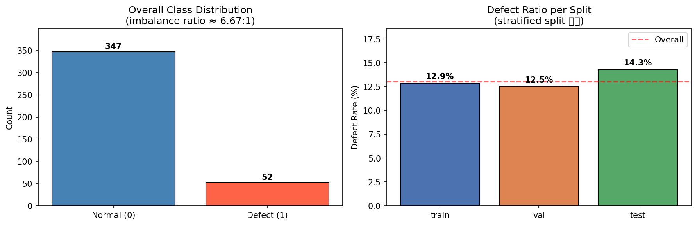

#### 결함 특성

결함은 금속 표면의 얇은 선형 균열 패턴으로, 배경 텍스처와 대비가 낮아 육안으로도 구분이 어려운 케이스 다수 포함.

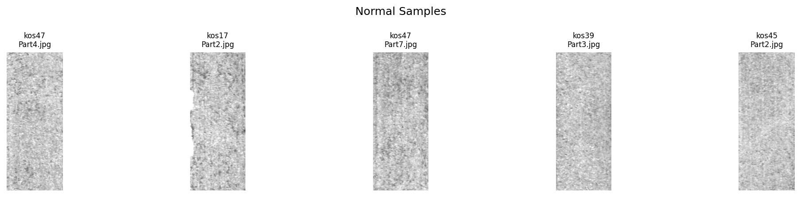

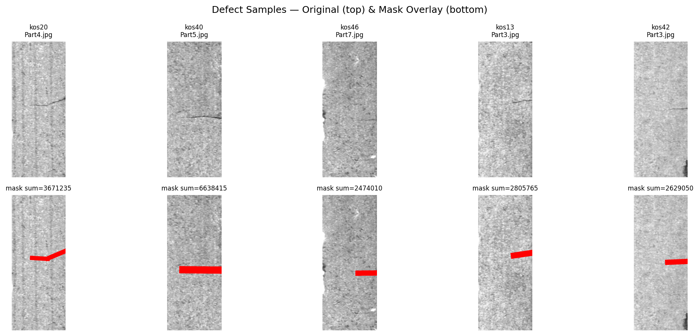

#### 픽셀 통계 (train 기준)

| 항목 | 값 |
|---|---|
| 평균 (Mean) | 0.7317 |
| 표준편차 (Std) | 0.0915 |
| 이미지 크기 범위 | 500x1235 ~ 500x1285 |

픽셀 강도가 좁은 범위(mean=0.7317, std=0.0915)에 밀집 — 결함/정상 간 통계 차이 작음. 국소 대비 강화(CLAHE) 적용의 배경.


---


### 베이스라인 모델

최소 증강(수평 플립, 리사이즈, 정규화)만 적용한 Simple Custom CNN으로 초기 성능 기준선 수립. 클래스 불균형 대응을 위해 BCEWithLogitsLoss에 pos_weight 자동 계산 적용.


#### 모델 구성

| 항목 | 값 |
|---|---|
| 아키텍처 | Simple Custom CNN (3-block) |
| 입력 크기 | 256x256 |
| 손실 함수 | BCEWithLogitsLoss (pos_weight 자동계산) |
| 옵티마이저 | Adam (lr=0.001) |
| 스케줄러 | CosineAnnealing |
| 에포크 | 50 (Early Stopping patience=10) |


#### 평가 결과 (threshold=0.5)

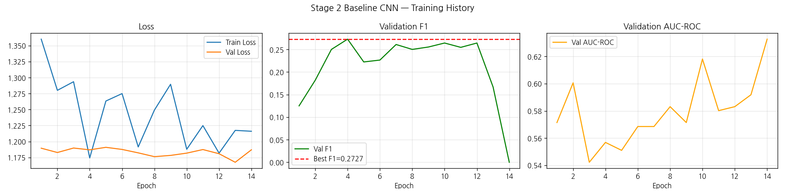

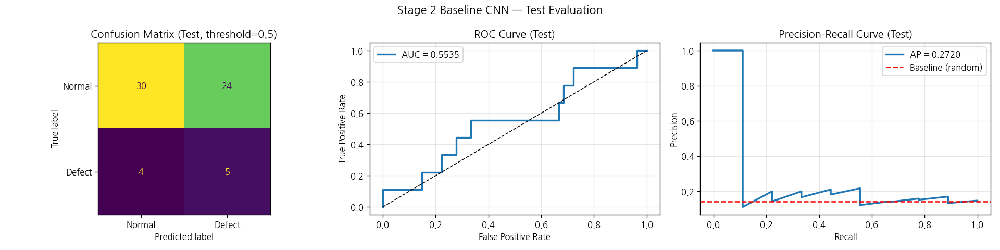

| 분할 | F1 | AUC-ROC | Precision | Recall |
|---|---|---|---|---|
| val | 0.2727 | 0.5569 | 0.1622 | 0.8571 |
| test | 0.2632 | 0.5535 | 0.1724 | 0.5556 |

높은 재현율과 낮은 정밀도가 공존하는 전형적인 불균형 초기 결과로 나타남. 이후 데이터 파이프라인 및 모델 개선을 통해 F1과 AUC-ROC를 함께 끌어올리는 것이 목표.


#### 실패 케이스 분석 (test set 기준)

| 구분 | 건수 | 추정 비용 (가정치) |
|---|---|---|
| FN | 4건 | 500만원/건 → 2,000만원 |
| FP | 24건 | 50만원/건 → 1,200만원 |
| **합계** | | **3,200만원** |

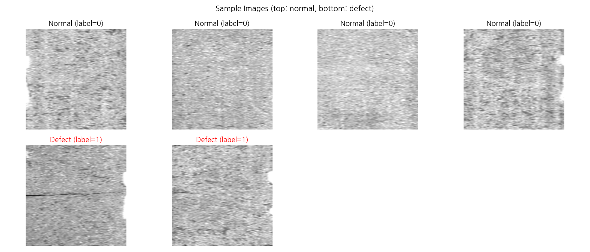

- **FN 주원인:** 원본 이미지 세로 방향 압축으로 인한 결함 소실 / 학습 결함 데이터 부족(36장) / threshold=0.5 부적절
- **FP 주원인:** 표면 노이즈·조명 불균일 오인 / 결함 인접 정상 이미지 혼동
- **개선 방향:** Augmentation 강화 + 클래스 불균형 보정 강화 → 전이학습 → threshold 최적화


---


### 데이터 중심 개선

베이스라인 CNN 아키텍처 유지, 데이터 파이프라인 개선에 집중. 증강 기법으로 AUC-ROC 및 AP 지표 개선 달성.


#### 적용 기법

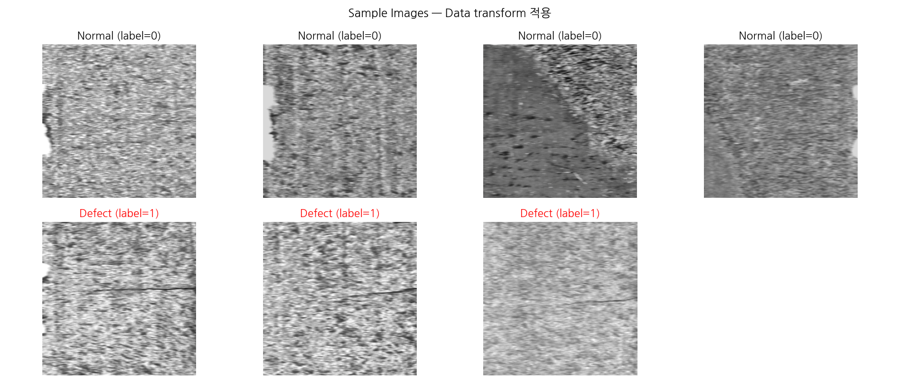

| 기법 | 설정 | 목적 |
|---|---|---|
| CLAHE | clip_limit=2.0, p=0.5 | 금속 표면 국소 대비 강화 |
| RandomBrightnessContrast | p=0.4 | 조명 변화 대응 |
| HorizontalFlip | p=0.5 | 좌우 대칭 불변성 확보 |
| BCEWithLogitsLoss + pos_weight | pos_weight≈6.78 | 클래스 불균형 보정 |


#### 검토 후 미적용 기법

| 기법 | 제외 사유 |
|---|---|
| 레터박스 리사이즈 | 패딩 영역이 이미지의 ~60% 차지 → CNN이 패딩을 배경으로 학습, FP 증가 |
| WeightedRandomSampler | pos_weight와 동시 적용 시 이중 보정으로 FP 폭증 |
| ElasticTransform | 선형 결함 패턴 왜곡, 소량 데이터(36장)에서 결함 특징 소실 |
| FocalLoss | alpha 방향이 불균형 구조와 불일치, 불안정 학습 |


#### 평가 결과 (threshold=0.5)

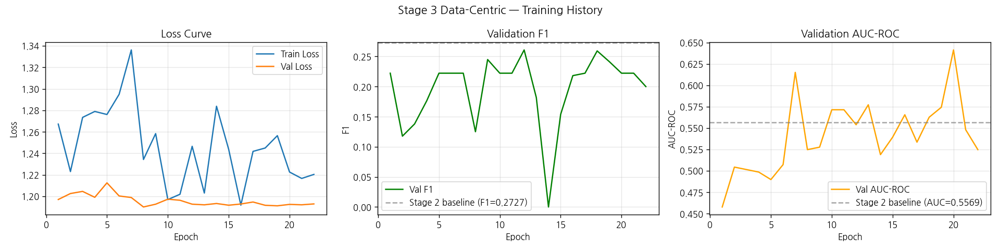

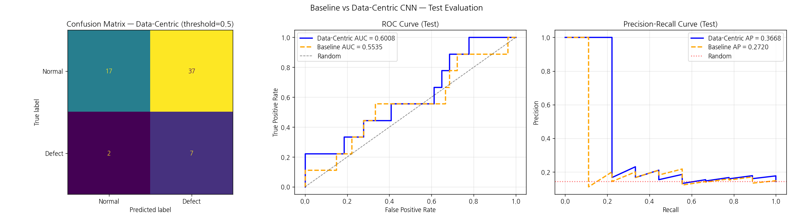

| 분할 | F1 | AUC-ROC | AP | Precision | Recall |
|---|---|---|---|---|---|
| val | 0.2609 | 0.5539 | 0.1538 | 0.1538 | 0.8571 |
| test | 0.2642 | 0.6008 | 0.3668 | 0.1591 | 0.7778 |


#### 베이스라인 대비 변화 (test set)

| 지표 | 베이스라인 | 데이터 중심 개선 | 변화 |
|---|---|---|---|
| F1 | 0.2632 | 0.2642 | +0.0010 |
| AUC-ROC | 0.5535 | 0.6008 | **+0.0473** |
| AP | 0.2720 | 0.3668 | **+0.0948** |
| Recall | 0.5556 | 0.7778 | **+0.2222** |
| FN 건수 | 4건 | 2건 | **-2건** |
| FP 건수 | 24건 | 37건 | +13건 |


---


### 모델 중심 개선

데이터 파이프라인(증강, pos_weight) 유지, 아키텍처를 Custom CNN에서 EfficientNet-B0(ImageNet 사전학습) 전이학습 모델로 교체. 2단계 파인튜닝(헤드 학습 5 에포크 → 전체 파인튜닝) 전략으로 특징 추출 능력 활용.


#### 모델 구성

| 항목 | 값 |
|---|---|
| 아키텍처 | EfficientNet-B0 (ImageNet 사전학습) |
| 입력 크기 | 256x256 |
| 파인튜닝 전략 | 2단계 (헤드 학습 5 에포크 → 전체 파인튜닝) |
| 정규화 | ImageNet 통계 (mean=[0.485,0.456,0.406], std=[0.229,0.224,0.225]) |
| 손실 함수 | BCEWithLogitsLoss (pos_weight 자동계산) |
| 옵티마이저 | Adam |
| 스케줄러 | CosineAnnealing |


#### 평가 결과 (threshold=0.5)

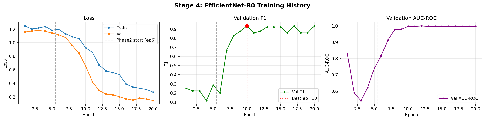

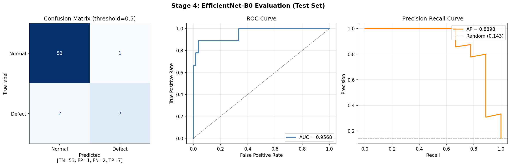

| 분할 | F1 | AUC-ROC | AP | Precision | Recall |
|---|---|---|---|---|---|
| val | 0.9333 | 0.9971 | 0.9821 | 0.8750 | 1.0000 |
| test | 0.8235 | 0.9568 | 0.8898 | 0.8750 | 0.7778 |

#### 데이터 중심 개선 대비 변화 (test set)

| 지표 | 데이터 중심 개선 | 모델 중심 개선 | 변화 |
|---|---|---|---|
| F1 | 0.2642 | 0.8235 | **+0.5593** |
| AUC-ROC | 0.6008 | 0.9568 | **+0.3560** |
| AP | 0.3668 | 0.8898 | **+0.5230** |
| FN 건수 | 2건 | 2건 | ±0건 |
| FP 건수 | 37건 | 1건 | **-36건** |


#### Grad-CAM (결함 위치 시각화)

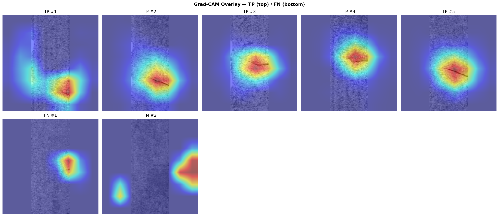

** FN 원인 **

- **FN #1 (contrast 부족):** 결함이 배경 텍스처와 대비가 낮아 육안으로도 모호한 수준. 모델의 관심도가 분산되어 결함 영역에 집중하지 못함.
- **FN #2 (레터박스 경계 오반응):** 결함이 희미하게 존재하나, 레터박스 패딩 경계의 대비선이 결함보다 강한 신호로 작용하여 탐지 실패.
- **공통:** TP 케이스 일부(#1)에서도 레터박스 경계 반응이 관찰됨. 복수 케이스에서 반복되는 점으로 보아 단순 노이즈가 아닌, 모델이 패딩 영역의 불필요한 특성을 학습했을 가능성이 높음. 레터박스 fill 값을 ImageNet 평균에 가까운 값으로 재조정하는 방향으로 추가 개선 여지가 있음.

---


### Threshold 최적화

EfficientNet-B0 기반 모델에 대해 FN/FP 비용 비대칭성을 반영한 threshold 최적화 수행, 전체 개선 과정의 PoC 분석 완료.

#### Threshold 최적화 결과 (test set 기준)

threshold 최적화 방안 중 **Cost Minimization** 채택. FN/FP 비용 비대칭성(10:1) 가정을 반영하여 추정 운영 비용 최소화를 우선 목적으로 설정. Youden's J(민감도+특이도 균형), F1-Optimal(F1 극대화)과 함께 비교하여 권고 threshold의 기준 독립성 검증.

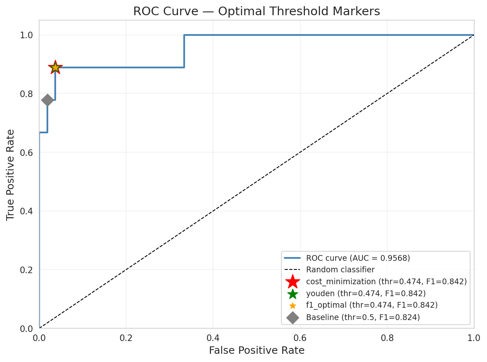

| 방법 | Threshold | F1 | Recall | Precision | FN | FP | 추정비용(만원) |
|---|---|---|---|---|---|---|---|
| EfficientNet-B0 + Aug | 0.5000 | 0.8235 | 0.7778 | 0.8750 | 2 | 1 | 1,050 |
| Cost Minimization | 0.4736 | 0.8421 | 0.8889 | 0.8000 | 1 | 2 | 600 |
| Youden's J | 0.4736 | 0.8421 | 0.8889 | 0.8000 | 1 | 2 | 600 |
| F1-Optimal | 0.4736 | 0.8421 | 0.8889 | 0.8000 | 1 | 2 | 600 |

3가지 방법 모두 threshold 0.4736으로 수렴. EfficientNet-B0 + 증강(thr=0.5) 대비 FN 2건→1건 감소, FP 1건→2건 소폭 증가. 비용 가정(FN:FP=10:1) 하에서 FN 1건 감소(500만원 절감)가 FP 1건 증가(50만원 추가)보다 크게 작용하여 추정 비용 1,050만원→600만원 **43% 절감**.

#### 민감도 분석 (Sensitivity Analysis)

FN/FP 비용은 산업 도메인 지식 없이 정확히 산정하기 어려움. 가정치가 달라질 경우 권장 threshold가 어떻게 변하는지 확인하기 위해 수행.

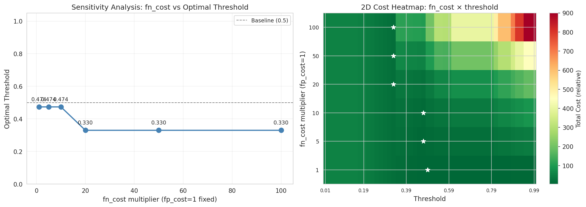

fn_cost 배율 1× - 100× 구간 스윕 결과, **1×~10× 구간(현재 가정 포함)에서는 threshold 0.4736 유지**. 단, **fn_cost 20× 이상(FN이 FP보다 200배 이상 비쌀 경우)에서는 threshold 0.33으로 이동**하여 Recall=1.0(FN=0) 우선 방향으로 변화. 비용 가정이 현재(10:1)보다 극단적으로 높아지지 않는 한 권장 threshold 유효.

---

### 추가 개선 실험

EfficientNet-B0 + 증강 파이프라인을 기반으로 TTA, 추가 증강 기법, WeightedSampler, 하이퍼파라미터 탐색 등 총 14종 실험을 수행하여 추가 개선 여지를 탐색.

#### 비교 기준 (EfficientNet-B0 + 증강, threshold=0.5)

| 분할 | F1 | AUC-ROC | Precision | Recall |
|---|---|---|---|---|
| val | 0.9333 | 0.9971 | 0.8750 | 1.0000 |
| test | 0.8235 | 0.9568 | 0.8750 | 0.7778 |

#### 실험 결과 요약

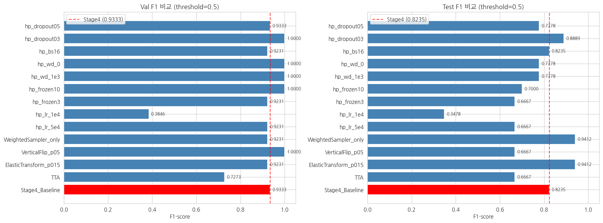

| 실험 | 내용 | 비고 |
|---|---|---|
| TTA | 수평 플립 앙상블 평균 | 역효과 |
| ElasticTransform (p=0.15) | 탄성 변형 증강 추가 | test 개선, val 소폭 하락 |
| VerticalFlip (p=0.5) | 수직 플립 증강 추가 | 역효과 |
| WeightedSampler (단독) | pos_weight 제거 + 배치 균등화 | test 개선, val 소폭 하락 |
| lr=5e-4 | 학습률 조정 | test 저하 |
| lr=1e-4 | 학습률 축소 | 수렴 실패 |
| frozen_epochs=3 | 헤드 학습 기간 단축 | test 저하 |
| frozen_epochs=10 | 헤드 학습 기간 연장 | test 저하 |
| weight_decay=1e-3 | 정규화 강화 | test 저하 |
| weight_decay=0 | 정규화 제거 | test 저하 |
| batch_size=16 | 배치 크기 축소 | 기준과 동일 |
| **dropout=0.3** | **드롭아웃 비율 조정** | **val·test 모두 개선 ← Best** |
| dropout=0.5 | 드롭아웃 비율 상향 | test 저하 |

#### 주요 발견

- **dropout=0.3** 이 val·test 양쪽에서 기준 대비 모두 개선된 유일한 실험. val F1=1.0, test F1=0.8889(+0.0654), test Recall=0.8889(+0.1111).
- **TTA, VerticalFlip**은 val에서 유지 또는 개선되더라도 test에서 역효과. 수직 방향 증강은 결함 패턴에 비유효한 도입으로 추정.

  *TTA n_aug(3/5/7) 비교 — n 값과 무관하게 기준 대비 일관된 성능 저하 확인*
  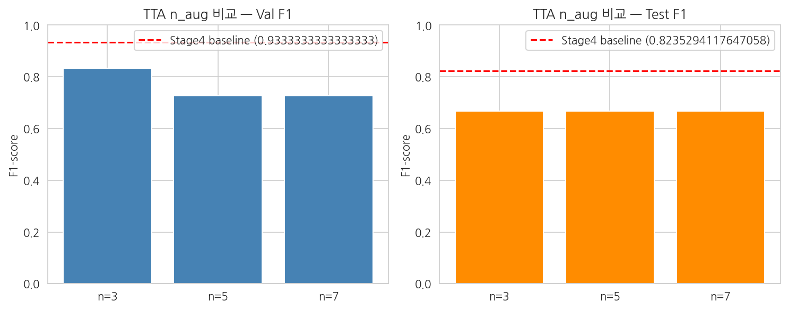
- **lr=1e-4**는 학습 자체가 수렴하지 못해 탈락. 현재 lr=1e-3(기본값)가 이 데이터셋에 적합한 범위.
- **ElasticTransform(p=0.15)·WeightedSampler 단독**은 test 기준 긍정적이나 val F1이 기준보다 소폭 낮아 dropout=0.3에는 미치지 못함.

#### 모델 성능 (dropout=0.3, threshold=0.5)

| 분할 | F1 | AUC-ROC | Precision | Recall | FN | FP |
|---|---|---|---|---|---|---|
| val | 1.0000 | 1.0000 | 1.0000 | 1.0000 | 0 | 0 |
| test | 0.8889 | 0.9938 | 0.8889 | 0.8889 | 1 | 1 |

비교 기준 대비: test F1 +0.0654, test Recall +0.1111, FN 2건→1건(-50%), FP 1건→1건(동일).

---


### PoC 종합 분석

추가 개선 실험 best 모델(EfficientNet-B0 + dropout=0.3)을 기반으로 비용 최소화 기준 threshold를 재도출하고, 추론 속도·연간 절감액·GO/NO-GO 판정을 포함한 PoC 종합 분석 수행.

#### 최적 Threshold 재도출 및 민감도 분석

비용 최소화(Cost Minimization) 방법으로 threshold 재도출. FN=500만원/건, FP=50만원/건 가정 유지.

| 항목 | 값 |
|---|---|
| 최적 threshold | 0.27 |
| F1 | 0.9000 |
| Recall | 1.0000 |
| Precision | 0.8182 |
| FN | 0건 |
| FP | 2건 |
| 추정 비용 | 100만원 |

FN 비용 배율 1× ~ 100× 구간 스윕. threshold 0.27, Recall=1.0(FN=0) 결과가 전 구간에서 유지됨.

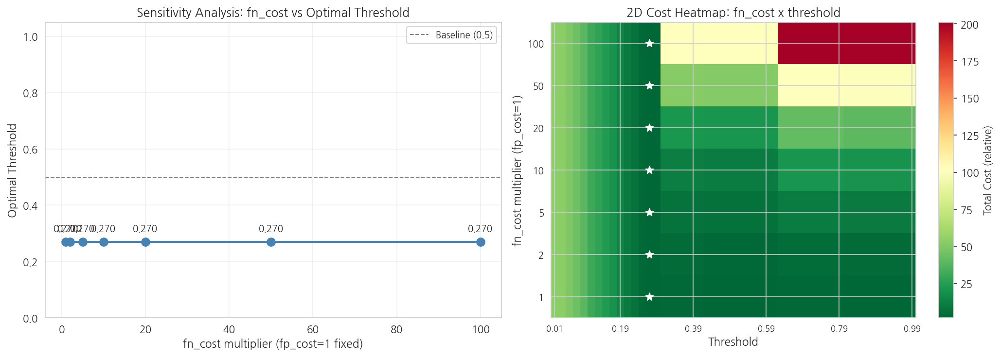

#### 결함 비용 추정 비교 (test set 기준)

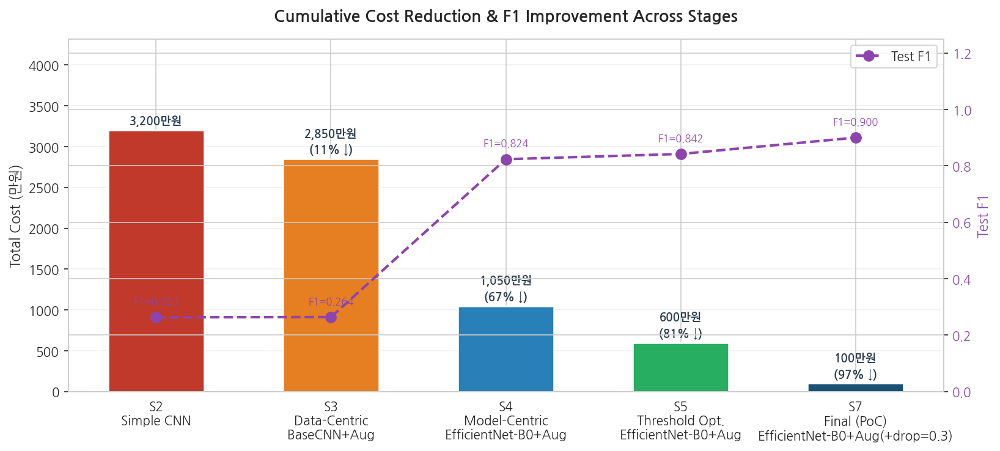

| 모델 | Threshold | FN | FP | 결함 비용 추정(만원) | Simple CNN 대비 |
|---|---|---|---|---|---|
| Simple CNN | 0.5 | 4 | 24 | 3,200 | - |
| Simple CNN + 증강 | 0.5 | 2 | 37 | 2,850 | -10.9% |
| EfficientNet-B0 + 증강 | 0.5 | 2 | 1 | 1,050 | -67.2% |
| EfficientNet-B0 + 증강 + threshold 조정 | 0.4736 | 1 | 2 | 600 | -81.3% |
| EfficientNet-B0 + dropout=0.3 + threshold 재조정 (PoC 최종) | 0.27 | 0 | 2 | 100 | **-96.9%** |

#### 연간 절감액 추정

연간 생산량 10,000개 가정, test set 오류율 비례 추정. **실제 현장 수치로 대체 필요한 가정치**.

> 수동 검사(검사원 인건비) 기반 비교는 검사원 오류율 데이터가 없으므로 수행하지 않았으며, 무검사 대비를 기준으로 설정하였음.

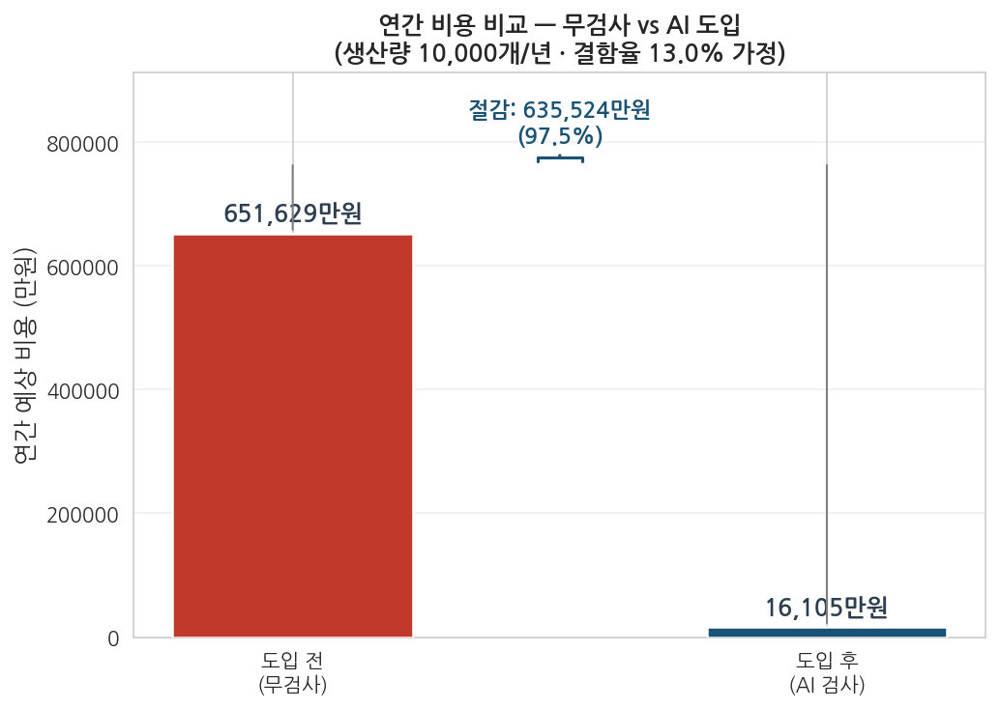

| 항목 | 값 |
|---|---|
| 무검사 시 연간 결함 추정 비용 | 651,629만원 |
| AI 검사 시 연간 결함 추정 비용 | 16,105만원 |
| 연간 절감액 | **635,524만원** |
| 절감률 | **97.5%** |

#### 추론 속도 (Inference Speed)

| 환경 | 평균 추론 시간 | FPS |
|---|---|---|
| CPU | 157.8 ms/image | 6.3 fps |
| GPU | 13.29 ms/image | 75.3 fps |

입력 크기: 3×256×256, 반복 100회 평균.

#### GO/NO-GO 판정

판정 기준값은 프로젝트 내 임의 설정값이며, 실제 도입 시 현장 요구사항으로 대체 필요.

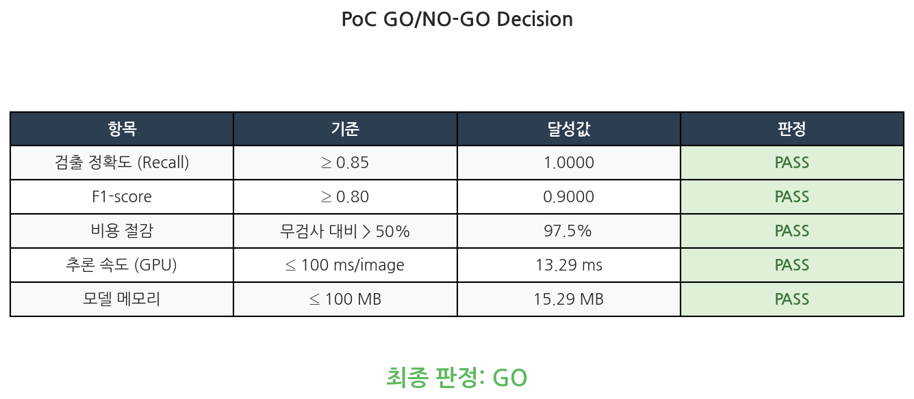

**최종 판정: GO**

#### 라이브 데모 미제공 안내

KolektorSDD 데이터셋은 **CC BY-NC-SA 4.0** 라이센스 적용으로 연구·비상업적 목적 전용이며 재배포가 금지되어 있습니다. 이에 따라 데이터셋 이미지를 포함하는 외부 시연 데모는 제공하지 않습니다.

---


## 개발 로드맵

- [x] 프로젝트 초기 설정 : 디렉토리 구조, 설정 파일, 의존성 관리
- [x] 탐색적 데이터 분석 : 클래스 분포 분석, 픽셀 통계 계산, 파트 단위 데이터 분할
- [x] 베이스라인 모델 : Simple CNN 구현, 초기 성능 기준선 수립 및 실패 케이스 분석 (test F1=0.2632, AUC=0.5535)
- [x] 데이터 중심 개선 : CLAHE/증강 강화, BCEWithLogitsLoss pos_weight 보정 (test F1=0.2642, AUC=0.6008, AP=0.3668)
- [x] 모델 중심 개선 : EfficientNet-B0 전이학습, 2단계 파인튜닝 (test F1=0.8235, AUC=0.9568, AP=0.8898)
- [x] Threshold 최적화 : 3가지 방법 수렴 (thr=0.4736), test F1=0.8421, 베이스라인 대비 총 비용 -81%
- [x] 추가 개선 실험 : TTA·VerticalFlip·ElasticTransform·WeightedSampler·하이퍼파라미터 탐색 14종 수행, dropout=0.3 최적 (test F1=0.8889, AUC=0.9938)
- [x] PoC 종합 분석 : threshold 재도출(0.27), FN=0·FP=2·비용 100만원, GPU 추론 13.3ms, 연간 절감 635,524만원(97.5%), GO 판정

---


## 라이센스

프로젝트 코드: MIT License 적용.

데이터셋 라이센스는 상단 [데이터셋 섹션](#데이터셋) 참조. KolektorSDD 데이터셋은 **CC BY-NC-SA 4.0** 라이센스 적용, 상업적 이용 금지.
